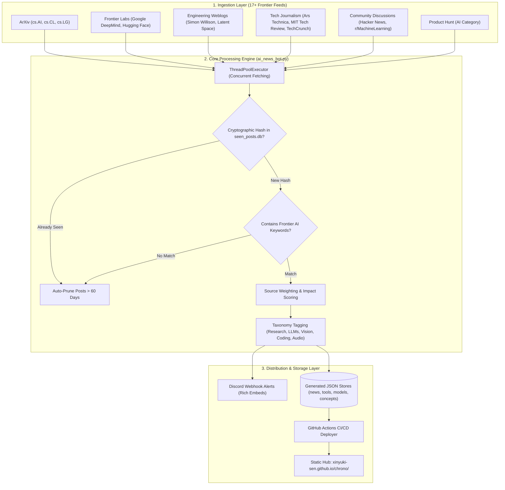

<div align="center">

  

  # Chrono
  ### Autonomous Real-Time AI Intelligence Hub, Research Radar & Tool Directory

  <p align="center">
    <b>Continuous algorithmic surveillance over frontier AI research, open-source weights, and emerging developer tooling.</b>
  </p>

  <p align="center">
    <a href="https://github.com/xinyuki-sen/ai-news-bot/actions/workflows/daily_scrape.yml"></a>
    <a href="https://xinyuki-sen.github.io/chrono/"></a>
    
    
    
  </p>

  <p align="center">
    <a href="#-the-problem--solution">The Problem</a> •
    <a href="#-system-architecture">Architecture</a> •
    <a href="#-core-capabilities">Capabilities</a> •
    <a href="#-quickstart">Quickstart</a> •
    <a href="#-configuration--environment">Configuration</a> •
    <a href="#-repository-structure">Structure</a>
  </p>

  <br />

  <a href="https://xinyuki-sen.github.io/chrono/">
    
  </a>

</div>

---

## ⚡ The Problem & Solution

| The AI Information Crisis | The Chrono Antidote |
| :--- | :--- |
| **Overwhelming Noise**: 500+ research papers, marketing fluff articles, and wrapper tools drop across fragmented platforms daily. | **Algorithmic Signal-to-Noise**: Weighted keyword filtering and high-impact vocabulary scoring surface only breakthrough releases. |
| **Duplicate Articles**: The same announcement is regurgitated by 20 tech blogs, spamming your feeds. | **Deterministic SQLite Deduplication**: Cryptographic post-hashing ensures you never see the same announcement twice. |
| **Fragmented Knowledge**: News lives on Twitter/X, papers on ArXiv, tools on Product Hunt, and concepts in wikis. | **Unified Intelligence Suite**: Aggregates breaking news, verified research, tool directories, model benchmarks, and prompt playbooks under one roof. |
| **Server Costs & Fragile Infra**: Traditional scrapers require persistent VMs, Postgres instances, and monthly cloud bills. | **100% Serverless & Zero-Cost**: Runs hourly on GitHub Actions cron with stateful storage persisted on `gh-pages`. |

---

## 🏗️ System Architecture

Chrono functions as an autonomous, self-healing pipeline that ingests, scores, stores, and broadcasts AI developments every hour without human intervention.



---

## 🚀 Core Capabilities

### 1. 📡 Multi-Source Frontier Radar
- **Academic Research**: Scans ArXiv cs.AI (Artificial Intelligence), cs.CL (Computation and Language / LLMs), and cs.LG (Machine Learning).
- **Frontier Labs**: Direct syndication from Google DeepMind and Hugging Face.
- **Deep Tech Analysis**: Curated blogs from industry leaders including Simon Willison and Latent Space.
- **Video Briefs**: Transcribed and indexed briefings from Two Minute Papers and 3Blue1Brown.

### 2. 🧠 Intelligent Scoring & Taxonomy
- **Relevance Scoring**: Dynamically calculates weight based on authoritative domain reputation (`Google DeepMind` = 3x, `cs.AI` = 3x, `Hacker News` = 2x).
- **Breakthrough Tagging**: High-impact flags trigger when models outperform benchmarks, launch new weights, or advance state-of-the-art inference.
- **Categorization**: News is automatically routed into clean buckets: `Research`, `Frontiers`, `Open Source`, `LLMs`, `Enterprise AI`, `Coding`, and `Engineering`.

### 3. 🛠️ Curated AI Tools Directory
- Hourly extraction from Product Hunt’s AI directory.
- Automated tag classification across 8 distinct professional workflows:
  `Coding` • `Writing` • `Image` • `Video` • `Audio` • `Productivity` • `Research` • `Chatbot/Assistant`

### 4. 🌐 Five-in-One Responsive Web Dashboard
Zero-dependency, high-performance static web suite styled with CSS custom properties (dark/light mode aware, 100/100 Lighthouse performance):
- **`index.html`**: Breaking news feed with instant live text search, category filters, and read-time estimates.
- **`tools.html`**: Filterable tool directory with direct launch links.
- **`models.html`**: Frontier LLM benchmark comparisons and arena rankings.
- **`concepts.html`**: Educational knowledge base explaining core architectures (Transformers, Diffusion, RAG, MoE).
- **`prompts.html`**: Battle-tested prompt engineering patterns.

### 5. 📢 Real-Time Discord Webhook Alerts
High-priority news items are instantly formatted into rich Discord embeds featuring category color-coding, direct citations, and publication timestamps.

---

## 🛠️ Quickstart

### Prerequisites
- Python 3.10+
- Git

### Local Execution in 60 Seconds

```bash
# 1. Clone the repository
git clone https://github.com/xinyuki-sen/ai-news-bot.git chrono
cd chrono

# 2. Install dependencies (ultra-lightweight: only feedparser & requests)
pip install -r requirements.txt

# 3. (Optional) Configure environment variables for Discord alerts
export DISCORD_WEBHOOK_URL="https://discord.com/api/webhooks/your/webhook/url"

# 4. Execute the aggregator
python ai_news_bot.py
```

Open `index.html` in your browser to inspect the freshly generated feed:
```bash
# Windows
start index.html

# macOS
open index.html

# Linux
xdg-open index.html
```

---

## ⚙️ Configuration & Environment

Chrono is designed to run with **zero required configuration** for local scraping. If Discord alerts or automated deployments are desired, provide the following variables:

| Variable | Type | Description | Required |
| :--- | :--- | :--- | :---: |
| `DISCORD_WEBHOOK_URL` | Secret / String | Webhook endpoint for dispatching breaking news embeds to Discord channels. | Optional |
| `GITHUB_TOKEN` | Secret / String | Default GitHub Actions token used to deploy built static assets to the `gh-pages` branch. | Actions Only |

---

## 🔄 Autonomous CI/CD Pipeline

Chrono uses a stateful, dual-branch Git architecture to remain **100% serverless**:

1. **Hourly Cron Schedule**: GitHub Actions wakes up every 60 minutes (`0 * * * *`).
2. **State Restoration**: The runner fetches `seen_posts.db` from the `gh-pages` branch, ensuring historical deduplication memory persists without cluttering the `main` git commit log.
3. **Scrape & Enrich**: `ai_news_bot.py` runs, updates JSON stores, and posts breaking items to Discord.
4. **Isolated Deploy**: The static HTML pages and updated JSON stores are pushed exclusively to `gh-pages`, serving the live site via GitHub Pages at zero hosting cost.

---

## 📂 Repository Structure

```text
chrono/
├── .github/
│   └── workflows/
│       └── daily_scrape.yml    # Hourly GitHub Actions cron & deploy workflow
├── assets/
│   ├── robot_icon.png          # Chrono brand icon
│   └── sidebar_logo.png        # Brand sidebar visual asset
├── ai_news_bot.py              # Master multi-threaded scraping & scoring engine
├── requirements.txt            # Minimal runtime dependencies
├── seen_posts.db               # SQLite database maintaining cryptographic dedupe cache
├── index.html                  # Real-time news feed web interface
├── tools.html                  # AI tools directory web interface
├── models.html                 # Frontier LLM benchmark catalog
├── concepts.html               # Foundational AI concepts reference
├── prompts.html                # Curated prompt engineering vault
├── news.json                   # Aggregated live news feed payload
├── tools.json                  # Parsed tools catalog payload
├── models.json                 # Model specifications & benchmark data
└── concepts.json               # Educational concept definitions
```

---

## 🤝 Contributing

Contributions, feed suggestions, and UI enhancements are welcome!

1. Fork the Project
2. Create your Feature Branch (`git checkout -b feature/NewFeed`)
3. Commit your Changes (`git commit -m 'feat: add cs.RO robotics feed'`)
4. Push to the Branch (`git push origin feature/NewFeed`)
5. Open a Pull Request

---

## 📄 License

Distributed under the **MIT License**. See [`LICENSE`](LICENSE) for more information.

<div align="center">
  <sub>Engineered by <a href="https://github.com/xinyuki-sen">xinyuki-sen</a> • Powered by open data & serverless automation.</sub>
</div>
